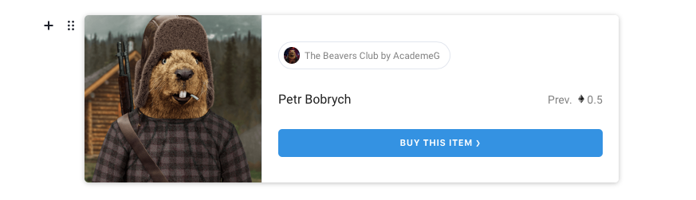

# Opensea Tool for Editor.js

Parses the pasted link to Opensea item and insert the embed block.



## Installation

Use your package manager to install the `@editorjs/opensea` package.

```
npm install -D @editorjs/opensea

yarn add -D @editorjs/opensea
```

## Usage

Import and add the Tool to Editor.js tools config.

```
import OpenseaTool from '@editorjs/opensea';

const editor = new EditorJS({
  tools: {
    opensea: {
      class: OpenseaTool
    },
  },

  // ...
});
```

Check out the [example page](./index.html).

## Output Data

Check the `OpenseaToolData` interface in [src/types/index.ts](./src/types/index.ts) file with types.

## Render Template

Use the following HTML to render the block.

```
<nft-card contractAddress="{ data.contractAddress }" tokenId="{ data.tokenId }"></nft-card>

<script src="https://unpkg.com/embeddable-nfts/dist/nft-card.min.js"></script>
```

## Development

This tool uses [Vite](https://vitejs.dev/) as builder.

`npm run dev` — run development environment with hot reload

`npm run build` — build the tool for production to the `dist` folder

## Links

[Editor.js](https://editorjs.io) • [Create Tool](https://github.com/editor-js/create-tool)